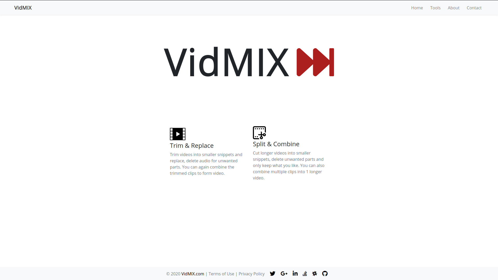
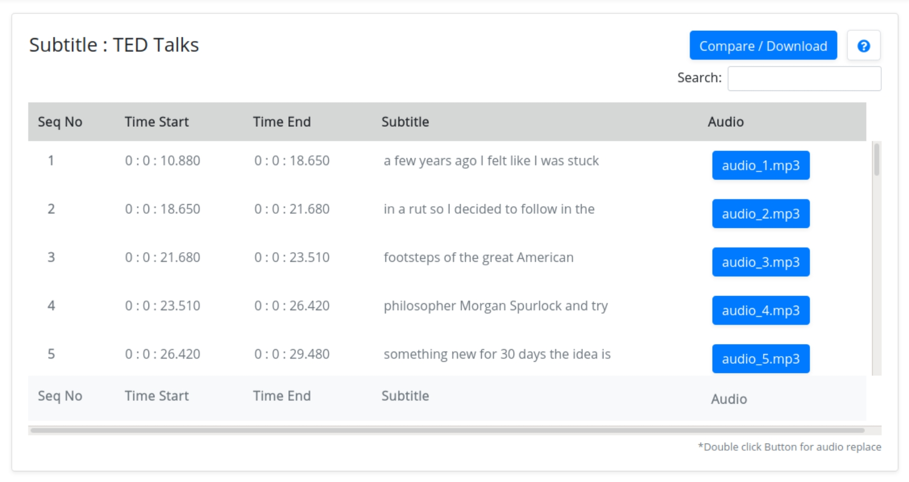

# VidMIX - Django

### Django & AngularJS app for Video Editing.

### Introduction :

This ia a `Django` application that allows a user to upload a video and its `.srt` file containing subtitles. The video will be broken into chunks, based on the timing information specified in the `.srt` file. The corresponding audio will be extracted from each video chunk and stored separately.

For the uploaded video, I had provide a facility that will display the start time, end time, video chunk sequence number, subtitles, and its respective audio `(.mp3)` as shown below. For each audio, there will be a facility to `[Upload]`, in which a user is allowed to re-upload the edited .mp3 file for that video chunk. The `[Download]` button will combine all the video chunks with respective audio chunks into single video `(.mp4 or .ogv)`. 

This Tool help you build, change your video efficiently and easily.

Hope You Enjoy!!

**Prerequisite :**
  * `Django-3.0.1`
  * `Python-3`
  * `Sqlite3` ( database )
  * `AngularJS` ( front-end ) 
  * `ffmpeg` ( video handeling )

### Features :
**1. Trim & Replace :**

>Trim videos into smaller snippets and replace, delete audio for unwanted parts. You can again combine the trimmed clips to form video.

**2. Split & Combine :**

>Cut longer videos into smaller snippets, delete unwanted parts and only keep what you like. You can also combine multiple clips into 1 longer video. 

### Setup :

`Make sure you have installed ffmpeg `

Clone the repository.
> git clone https://github.com/dssudake/VidMIX-Django.git

Create a virtual environment and activate
>virtualenv venv  
> source venv/bin/activate

Install requirements using pip.
>pip install -r requirements.txt

Get Project running on [`localhost:8000`](http://localhost:8000/) in browser window.
>cd vidmix  
>python manage.py runserver

